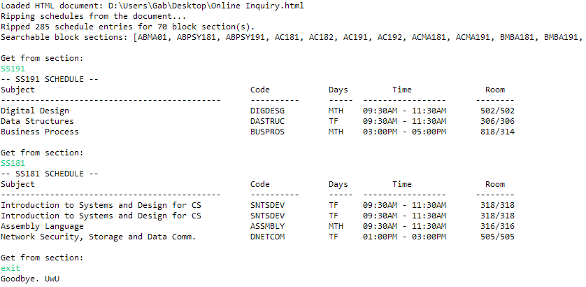

# Sched Ripper

* Extracts and parses subject scheduling data from an HTML document for easier searching. Retrofitted for Asia Pacific College.
* Utilizes the Jsoup HTML parsing library.

## What it does?

* Reads an HTML file that lists all subject offerings and respective schedules.
* Parses data from the HTML file.
* Presents the data in an easily-searchable manner.

## How to use it?

* Compile the code.
* Provide a valid HTML document to read. Use the one from the online portal.
* Input a specific section name to get their schedule for the current term.
* Voila!
